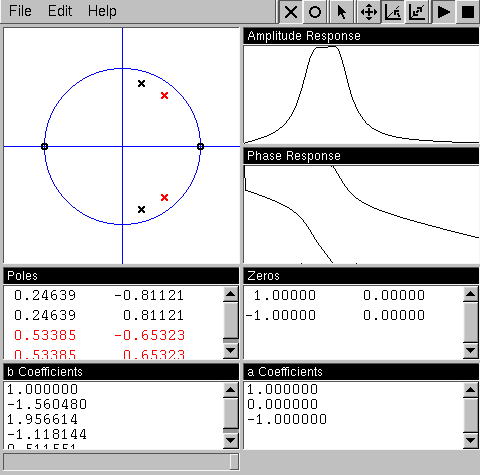

polarbear
---------

polarbear is a tool for designing filters in the complex domain. Filters can be
designed by placing any number of poles and zeros on the z plane. From this the
filter coefficients are calculated, and the filter can be applied in real time
on an audio stream.

This code is mirrored from the old location which can still be seen on the
wayback machine: https://www.resorama.com/maarten/polarbear/

